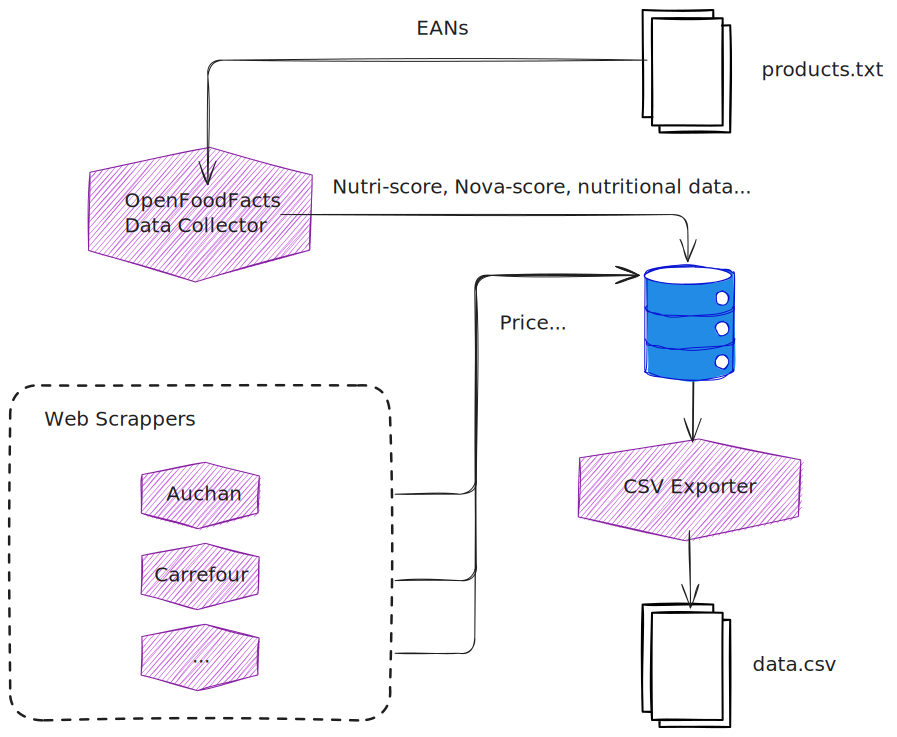

# Proteines Resilientes

Proteines Resilientes is a data study designed to gather information from
various online sources about food products sold in France, particularly their
nutritional facts. The project's primary objective is to compare plant-based and
animal-based products to assess their affordability, protein content, and other
relevant factors.

Global technical diagram of the solution:



And the diagram of the relational database model:



## Installation

This Python project is packaged with [Poetry][poetry].

To install the project dependencies:

    $ poetry install

Poetry installs all the dependencies in a virtual environment. To activate the
environment:

    $ $(poetry env activate)

## Usage

The project is made of multiple CLI tools. Their exhaustive list can be found in
the `project.scripts` section of the [`pyproject.toml`](./pyproject.toml) file.

All the CLI tools can be invoked with `-h` or `--help` to get the list of all
their positional parameters and options.

### Open Food Facts Data Collector

The Open Food Facts Data Collector (OFFDC) takes a list of [EAN-13][ean-13]
(product references) as input and fetches the corresponding product data from
[Open Food Facts][off] via its REST API.

The EAN-13 references can be directly passed as positional parameters, or via a
text file containing one single EAN-13 per line:

```bash
# Query one single EAN-13 via a positional parameter.
$ pr-offdc 3181238942328

# Query multiple EAN-13 via positional parameters.
$ pr-offdc 3181238942328 3175681104112 3564700726044

# Query multiple EAN-13 via a text file.
$ cat <<EOF > references.txt
# This line is a comment.
3181238942328
3175681104112

# Newlines are ignored.

3564700726044
EOF
$ pr-offdc -f references.txt
````

By default, the products already present in the database are skipped. To force
the creation of a new `Source` entry with the most recent data from Open Food
Facts, the `--force` option needs to be set. It can be jointly used with the
`--all` option to include all the products already present in the database:

    $ pr-offdc --all --force

### Scraper for Auchan

The web scraper for [Auchan][auchan] requires keywords as positional parameters
which will be used to query the search engine present on Auchan's website in
order to select products to scrap.

For instance, to scrap the results of a query for `lentilles vertes`:

    $ pr-scraper-auchan 'lentilles vertes'

However, by default, when opening a product page, the price is absent from it.
This is because a specific physical store needs to be selected first as prices
differ across locations.

To do so, Auchan uses a notion of "journey ID". When opening the website
for the first time, the web application makes an HTTP GET request to
`https://www.auchan.fr/journey` which returns a JSON payload similar to this
one:

```json
{
  "id": "defa0178-defa-defa-defa-defa01720217",
  "address": null,
  "location": null,
  "accuracy": null,
  "activeContexts": [
    { "type": "GROCERY", "context": null },
    { "type": "ONLINE", "context": null },
    { "type": "STORE", "context": null }
  ],
  "contextHistory": [],
  "metadata": {}
}
```

When selecting a physical store in the corresponding menu, an HTTP POST request
this time is sent to `https://www.auchan.fr/journey/update` with a payload
similar to this one:

```raw
offeringContext.seller.id=2d925183-cd3a-44fc-b78d-3c88f0a6b4e4
offeringContext.channels[0]=PICK_UP
offeringContext.storeReference=54
address.zipcode=37000
address.city=Tours
address.country=France
location.latitude=47.39004735604831
location.longitude=0.6889267691544205
accuracy=MUNICIPALITY
position=1
journeyId=defa0178-defa-defa-defa-defa01720217
```

Here, an arbitrary store in Tours was chosen. The request will update the "user
journey" (here, the journey ID is `defa0178-defa-defa-defa-defa01720217`) with
this location information. From now on, all future requests to product pages
comprising the cookie `lark-journey` with the journey ID as value will return
location-specific information, including the price.

The `--journey-id` CLI option is meant to set an arbitrary value of journey ID
when scraping the product pages:

    $ pr-scraper-auchan --journey-id '9ca9e4a5-0d62-4a94-9f92-c7c88e374a7f' 'lentilles vertes'

## Development

### Testing

To run all the tests:

    $ python -m unittest discover

### Database Migrations

[Alembic][alembic] is used to manage the database migrations. It is part of the
development dependencies of the project that are automatically installed when
running `poetry install`.

When updating the database schema in `./src/models`, Alembic can automatically
detect drifts between the models and the current state of the actually database,
and then generate migration scripts:

    $ alembic revision --autogenerate -m "Migration description..."

A new migration script will be added to `./migrations/versions`. As some schema
drifts cannot be automatically detected by Alembic (e.g. change of table name),
the migration commands need to be reviewed and adjusted if necessary.

More information on the auto-generated migration scripts can be found in the
[Alembic official documentation][alembic-autogenerate].

To apply the migration scripts to the latest available revision:

    $ alembic upgrade head

## Documentation

### Generating the Mermaid diagrams

To generate the diagrams made with [mermaid][mermaid]:

    $ npx -p @mermaid-js/mermaid-cli mmdc -i <input> -o <output>

For instance, to generate an SVG image of the relational database diagram:

    $ npx -p @mermaid-js/mermaid-cli mmdc -i docs/rdb_diagram.mermaid -o docs/rdb_diagram.svg

 [alembic]: https://alembic.sqlalchemy.org "Alembic documentation website"
 [alembic-autogenerate]: https://alembic.sqlalchemy.org/en/latest/autogenerate.html "Auto Generating Migrations - Alembic documentation"
 [auchan]: https://www.auchan.fr/ "Auchan"
 [ean-13]: https://en.wikipedia.org/wiki/International_Article_Number "International Article Number - Wikipedia"
 [mermaid]: http://mermaid.js.org/ "Mermaid website"
 [off]: https://world.openfoodfacts.org/ "Open Food Facts"
 [poetry]: https://python-poetry.org "Poetry website"
